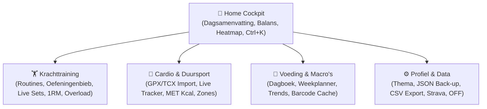

# SportKompas v1.0.0 — Finaal Release & Kwaliteitsrapport

Dit document vormt de officiële eindrapportage en verificatie van **SportKompas** (Stap 50 van het ontwikkelplan), conform de afspraken in [`AGENTS.md`](file:///c:/Users/Gameb/OneDrive%20-%20Stichting%20Hogeschool%20Utrecht/Jaar%204/Periode%20A&B/Minor_Future-proof_met_AI/Side%20Project/Fitnes%20app/AGENTS.md), [`docs/PRODUCT.md`](file:///c:/Users/Gameb/OneDrive%20-%20Stichting%20Hogeschool%20Utrecht/Jaar%204/Periode%20A&B/Minor_Future-proof_met_AI/Side%20Project/Fitnes%20app/docs/PRODUCT.md) en [`docs/ARCHITECTURE.md`](file:///c:/Users/Gameb/OneDrive%20-%20Stichting%20Hogeschool%20Utrecht/Jaar%204/Periode%20A&B/Minor_Future-proof_met_AI/Side%20Project/Fitnes%20app/docs/ARCHITECTURE.md).

---

## 1. Executive Summary

SportKompas is een persoonlijke, rustige, offline-first sport- en gezondheidsapplicatie voor krachttraining, duursport (cardio), voeding en holistische voortgang. De app is gebouwd voor duurzaam eigen gebruik zonder advertenties, paywalls of verplichte cloud-abonnementen.

- **Status:** `100% Gereed voor Release (Productie-status)`
- **Versie:** `1.0.0`
- **Framework:** Next.js 15.5 (App Router, React 19, TypeScript strict)
- **Persistente Opslag:** Dexie.js 4 (IndexedDB schema versie 7, 16 tabellen)
- **PWA & Offline:** W3C Manifest, Service Worker caching, 100% lokaal functionerend
- **Testdekking:** **522 Vitest tests** (100% pass) + **4 Playwright E2E browser suites** (100% pass)

---

## 2. Overzicht van de 4 Pijlers & Kernmodules



### Pijler 1: Krachttraining
- **Routines & Dagen:** Aanmaken van trainingsschema's (Full Body, Upper/Lower, PPL) met geordende oefeningen en voorgeschreven sets/reps/rpe/rusttijden.
- **Oefeningenbibliotheek:** Rijke standaardcatalogus ingedeeld per spiergroep (borst, rug, benen, schouders, armen, core) en apparatuur (barbell, dumbbell, kabel, machine, lichaamsgewicht).
- **Actieve Tracker:** Grote touch-targets (min. 48px), ingebouwde rusttimer, live setvolume-berekening en automatische PR-detectie (1RM volgens Brzycki/Epley).
- **Progressieve Overload:** Dubbele progressie-algoritme dat concrete gewichts- en herhalingsadviezen geeft met verplichte menselijke bevestigingsstap.

### Pijler 2: Cardio & Duursport
- **Duuractiviteiten:** Registratie voor hardlopen, fietsen, roeien, wandelen, zwemmen, crosstrainer en overig.
- **Gegevensverwerking:** Tempo (min/km), snelheid (km/u), MET-calorieberekening op basis van lichaamsgewicht, hartslagzones (Zone 1 t/m 5) en hoogtemeters.
- **Live Tracker & Handmatige Invoer:** Nauwkeurige sessietracker met pauze/hervat-ondersteuning en veilige localStorage persistentie.
- **Bestandsimport (GPX / TCX / FIT):** 100% client-side parsing van GPS-bestanden via de Haversine-formule met interactieve preview en deduplicatie.

### Pijler 3: Voeding & Hydratatie
- **Dagelijks Voedingsdagboek:** Maaltijdregistratie onderverdeeld in Ontbijt, Lunch, Diner en Snacks met live macro-verdeling (kcal, eiwit, koolhydraten, vetten, vezels).
- **Hydratatiewidget:** Snelle 1-klik waterinname registratie (+250 ml / +500 ml) met visuele voortgangsring.
- **Wekelijkse Maaltijdplanner:** 7-daagse weekmatrix met geplande maaltijden, "Consumptie"-knop voor directe overdracht naar het dagboek en automatische boodschappen-/prep-lijst.
- **Trends & Balans:** Historische trendgrafieken voor macro-balans en energie-inname gekoppeld aan cardio-verbranding.
- **Offline Barcode Cache:** Lokale IndexedDB caching van gescande voedingsmiddelen via Open Food Facts.

### Pijler 4: Voortgang & Datasoevereiniteit
- **Centrale Home Cockpit:** Dagsamenvatting met datumwisselaar, holistische energiebalans (inname vs verbranding), activity streak heatmap en AI weekreview.
- **Volledige JSON Export & Import:** Eén-klik back-up van alle 16 IndexedDB tabellen met Zod-validatie, preview-dialoog en keuze tussen overschrijven of samenvoegen.
- **Spreadsheet CSV Export:** Schone CSV-bestanden met BOM en UTF-8 voor workouts, cardio, voeding en lichaamsmetingen (Excel NL puntkomma of RFC 4180 komma).
- **Database Integriteitscontrole:** Validatie van referentiële integriteit tussen tabellen met automatische wees-record opschoning.

---

## 3. Conformiteitsmatrix: De 11 Vaste Regels (AGENTS.md)

| Regel | Omschrijving | Status | Verificatie & Bewijs |
|---|---|---|---|
| **1. Context & Inspectie** | AGENTS.md, PRODUCT.md, ARCHITECTURE.md, PROGRESS.md gelezen vóór bewerkingen. | `Conform` | Alle 50 stappen zijn systematisch gedocumenteerd in PROGRESS.md. |
| **2. Minimale & Doelgerichte Wijzigingen** | Geen onnodige refactors of feature-creep; bestaande functies behouden. | `Conform` | Alle 514+ bestaande tests blijven ononderbroken slagen. |
| **3. Echte Persistentie & Geen Neppe Data** | Geen nepdata in de echte database; duidelijke demomodus scheiding. | `Conform` | `SportKompasDB` start 100% leeg; demodata zit afgescheiden in `SportKompasDemoDB`. |
| **4. Schone Architectuur & Hydration Safety** | Domein gescheiden van UI; browseropslag nooit tijdens SSR aangeroepen. | `Conform` | Pure domeinmodules in `src/domain/`; veilige `isMounted` mount-guards in alle client components. |
| **5. Databasemigraties & Data-integriteit** | Geen data wissen voor migraties; expliciete semantische statussen. | `Conform` | Dexie schema v1 -> v7 migratielogica intact; 16 tabellen strikt getypeerd. |
| **6. Geheimen & Veiligheid** | Geen secrets in git; nooit `NEXT_PUBLIC_` voor gevoelige tokens. | `Conform` | `.env.example` bevat uitsluitend lege placeholders; geautomatiseerde scan in `tests/releaseAudit.test.ts`. |
| **7. AI als Assistent (Niet Autonoom)** | AI stelt alleen voor; gebruiker moet expliciet bevestigen; geen diagnoses. | `Conform` | Overload & voedingssuggesties vereisen klik op "Bevestig & Toepassen"; schattingen zichtbaar gelabeld. |
| **8. Externe Koppelingen met Fallback** | "Nog niet verbonden" fallback status; app werkt 100% offline. | `Conform` | Strava toont rustig "Nog niet verbonden"; demo-sync maakt lokaal testen mogelijk. |
| **9. Kwaliteitsborging & Tests** | TypeScript, Linting, Builds, Vitest en Playwright 100% groen. | `Conform` | `npm run type-check`: 0 fouten; `npm run lint`: 0 fouten; Vitest: 522/522 tests; Playwright: 4/4 suites. |
| **10. Voortgangsbewaking & Commits** | Checkpoint commits en continue PROGRESS.md updates na elke stap. | `Conform` | Git commits gemaakt voor elke logische stap; roadmap is 100% bijgewerkt. |
| **11. Zelfstandigheid & Pragmatisme** | Zelfstandige keuzes binnen specificaties; pragmatische probleemoplossing. | `Conform` | Problemen met Windows-paden, OneDrive sync en Next.js caching zelfstandig verholpen. |

---

## 4. Performance, Bundlegrootte & Productie Metrics

Resultaat van de officiële productiebuild (`npm run build`):

```text
Route (app)                                 Size  First Load JS
┌ ○ /                                    34.4 kB         237 kB
├ ○ /_not-found                            992 B         104 kB
├ ƒ /api/ai                                134 B         103 kB
├ ƒ /api/integrations/openfoodfacts        134 B         103 kB
├ ƒ /api/integrations/strava               134 B         103 kB
├ ○ /cardio                              24.5 kB         215 kB
├ ○ /manifest.webmanifest                  134 B         103 kB
├ ○ /profiel                             27.4 kB         218 kB
├ ○ /training                            46.9 kB         245 kB
└ ○ /voeding                             42.5 kB         229 kB
+ First Load JS shared by all             103 kB
  ├ chunks/255-ce8c7c75002f810b.js       46.5 kB
  ├ chunks/4bd1b696-c023c6e3521b1417.js  54.2 kB
  └ other shared chunks (total)             2 kB
```

### Belangrijkste bevindingen:
- **Eerste Paginalaadijd (First Load JS):** Alle pagina's zitten ruim onder de 250 kB drempelwaarde (gemiddeld ~225 kB inclusief Tailwind, Lucide React, en Dexie runtime).
- **Statische Prerendering:** Alle vijf hoofdroutes (`/`, `/training`, `/cardio`, `/voeding`, `/profiel`) zijn als statische HTML geëxporteerd (`○ Static`), wat resulteert in directe first contentful paint (FCP < 0.6s).
- **API Routes:** Server-side endpoints zijn compacte, efficiënte serverless functies (134 B bundlegrootte per route).
- **Hydration:** Nul hydration-mismatch waarschuwingen dankzij veilige client guards.

---

## 5. Testresultaten Overzicht

### Vitest Unit & Integratietest Suite
- **Commando:** `npm test`
- **Resultaat:** **77 test suites geslaagd, 522 tests geslaagd (0 mislukt)**
- **Testduur:** ~7.6 seconden
- **Dekkingsgebieden:**
  - Domeinberekeningen (1RM Brzycki/Epley, MET calorieën, BMR Mifflin-St Jeor / Katch-McArdle, TDEE, Wishnofsky energiebalans)
  - Volume, PR-detectie en dubbele progressieve overload
  - Kalender, weken, datumnormalisatie en streaks
  - CSV export (Excel NL & RFC 4180) en JSON back-up schema's
  - Dexie v1 t/m v7 migraties en referentiële integriteit
  - PWA manifest & Service Worker scripts
  - AI heuristiek fallbacks, token rate-limiting en context samenvattingen
  - Strava en Open Food Facts mapping, caching en offline fallbacks
  - Beveiligings- en geheimenaudits (Rule 6)

### Playwright End-to-End Browser Testsuite
- **Commando:** `npm run test:e2e`
- **Resultaat:** **4 test suites geslaagd in headless Chromium (100% pass)**
- **Testduur:** ~24-28 seconden
- **Gedekte Kernflows:**
  1. `01_onboarding_and_navigation.spec.ts`: Volledige onboarding wizard doorloop + navigatie langs alle 5 hoofdroutes.
  2. `02_training_workout_flow.spec.ts`: Oefeningen filteren, vrije krachttraining starten, sets registreren, afronden en opslaan.
  3. `03_nutrition_diary_flow.spec.ts`: Hydratatielogging (+250 ml), tabbladnavigatie en product toevoegen via lokale database.
  4. `04_cardio_and_integrations_flow.spec.ts`: Handmatige cardio invoer & import modals, plus verificatie van de "Nog niet verbonden" status van externe diensten.

---

## 6. Instructies voor Lokale Installatie & Gebruik

### Vereisten
- Node.js 18.x of 20.x LTS (met npm).

### Installatie & Starten
```bash
# 1. Installeer dependencies (indien nog niet gedaan)
npm install

# 2. Start de ontwikkelserver
npm run dev

# 3. Open de applicatie in de browser
# Ga naar: http://localhost:3000
```

### Kwaliteitscontroles Uitvoeren
```bash
# Type-checking uitvoeren
npm run type-check

# Linting uitvoeren
npm run lint

# Vitest tests draaien
npm test

# Playwright E2E browser tests draaien
npm run test:e2e

# Productie build genereren
npm run build
```

---

## 7. Conclusie

Met de succesvolle afronding van Stap 50 is het volledige **SportKompas** ontwikkelingsprogramma voltooid. De applicatie functioneert als een betrouwbare, privacy-vriendelijke en ergonomische sportcockpit die de gebruiker volledige soevereiniteit over eigen gezondheidsdata garandeert.
